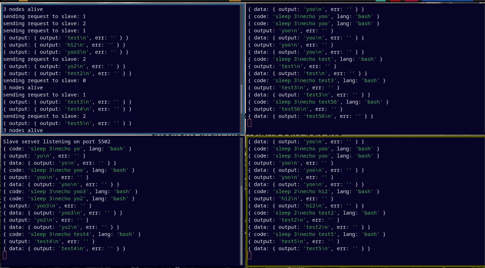

# Node-Balancer

Load balancer system for horizontal scaling implemented in Node.Js

## Demo

### One balancer + 3 nodes

## Working

- The system consists of one master server and a template slave server
- As shown in the demo, you can run as many instances of slave servers as needed. This can be run in multiple computers/nodes.
- Add the required client ip address and port in the [allSlaves.js](server/master/allSlaves.js) file as given
- The system will poll the slave server at regular intervals to check if they are alive
- The clien app makes all requests from all the instances to the same master load balancer url.
- the load balancer then sends the entered code (bash or javascript for now) to a slave node to be processed
- once the data is received from slave node, it is sent back to the client

## Features

- scheduling based on isActive boolean
  - set when a new task is assigned
  - removed when the task has been completed
  - in case all nodes are active, the balancer loops and waits for 2 seconds for a free server and if not found, given to the next one to be parallelly processed in order to prevent infinite wait
- polling feature to calculate and account for slave nodes
- if a slave is not responding for a while and then comes back online later, this will be made use of by the load balancer

P.S. I've no idea if this is exactly how an actual load balancer is implemented in the industry.
This is my own implementation of the concept of load balancing and horizontal scaling which does the division of labour as intended✨
